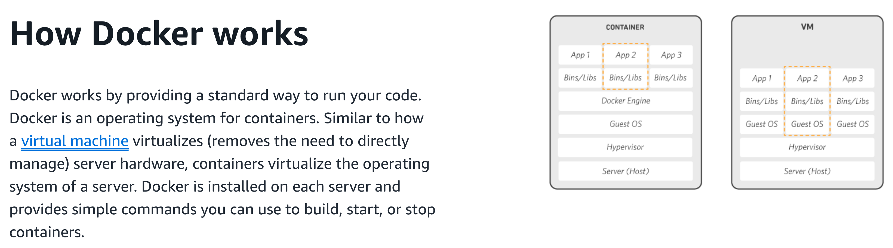

### Docker Basis

>Docker (Quote from AWS):
>
>1. It is a software platform that allows you to **<u>build, test, and deploy</u>** consistent applications **<u>quickly</u>**.
>2. It packages software into **<u>standardized units</u>** called [containers](https://aws.amazon.com/containers/) that have everything the software needs to run, including libraries, system tools, code, and runtime. 
>
>**It is like the operating system on our computer.**




#### 1. What is a container?

<details>
<summary>Video: Docker concepts - What is a container? </summary>
<iframe width="896" height="488" src="https://www.youtube.com/embed/W1kWqFkiu7k" title="Docker concepts - What is a container?" frameborder="0" allow="accelerometer; autoplay; clipboard-write; encrypted-media; gyroscope; picture-in-picture; web-share" referrerpolicy="strict-origin-when-cross-origin" allowfullscreen></iframe>
</details>
>  Simply put, containers are isolated processes for different applications with different environment setups running on top of the Docker. 
>
>  **It is like the running application on our computer.**


#### 2. What is an image?

<details>
<summary>Video: Docker concepts - What is an image? </summary>
<iframe width="896" height="488" src="https://www.youtube.com/embed/NyvT9REqLe4" title="Docker concepts - What is an image?" frameborder="0" allow="accelerometer; autoplay; clipboard-write; encrypted-media; gyroscope; picture-in-picture; web-share" referrerpolicy="strict-origin-when-cross-origin" allowfullscreen></iframe>
</details>
> Simply put, images are immutable files that contain all required supporting libraries, packages, contents, and your apps and define how to run your apps.
>
> **It is like software installers (we also call it image back in the day) to be installed on our computer.**


#### 3. What is a registry?

It is an online resource where you can upload your defined images and download them from anywhere.

You can push your images and pull them later.

Docker uses the [Docker Hub](https://hub.docker.com/?_gl=1*r6gvh7*_gcl_au*MTc4NTExMTkxNC4xNzM2NDc3NjU1*_ga*MTQwMTQ4NDU2MC4xNzM2MTg5MDQ0*_ga_XJWPQMJYHQ*MTczNzUxOTk5MS44LjEuMTczNzUyNDEzMC41OS4wLjA.) by default as a public image registry.


### A docker helloWorld

1. Download the docker desktop by following [windows-install](https://docs.docker.com/desktop/setup/install/windows-install/) or [mac-install](https://docs.docker.com/desktop/setup/install/mac-install/).

2. Start the docker desktop, which also starts the docker engine.

3. [Run the hello-world container](https://docs.docker.com/get-started/introduction/get-docker-desktop/):

   ``` bash
   docker run -d -p 8080:80 docker/welcome-to-docker
   ```

   - `-d`: running the container in detached mode.
   - `-p`: port mapping: in this case, we map port 80 inside the container to port 8080 of our host machine.
   - `docker/welcome-to-docker`: the published image identifier for this container. It is [released on the DockerHub](docker/welcome-to-docker).

   Outputs:

   ``` bash
   > docker run -d -p 8080:80 docker/welcome-to-docker
   Unable to find image 'docker/welcome-to-docker:latest' locally
   latest: Pulling from docker/welcome-to-docker
   579b34f0a95b: Pull complete
   d11a451e6399: Pull complete
   54b19e12c655: Pull complete
   1c2214f9937c: Pull complete
   1fb28e078240: Pull complete
   94be7e780731: Pull complete
   b42a2f288f4d: Pull complete
   89578ce72c35: Pull complete
   Digest: sha256:eedaff45e3c78538087bdd9dc7afafac7e110061bbdd836af4104b10f10ab693
   Status: Downloaded newer image for docker/welcome-to-docker:latest
   2f199106b454c1b173a1cacb06206cba483824397a934fda331a0bcd70be6283
   ```

4. Visit http://localhost:8080.


### How to build an image?

We can take a look at the "docker/welcome-to-docker" project on [GitHub](https://github.com/docker/welcome-to-docker/blob/main/Dockerfile).

To build an image, we need to define a **Dockerfile**.

In this case:

``` dockerfile
# Start your image with a node base image for javascript environment
FROM node:18-alpine

# The /app directory should act as the main application directory
WORKDIR /app

# Copy the app package and package-lock.json file
COPY package*.json ./

# Copy local directories to the current local directory of our docker image (/app)
COPY ./src ./src
COPY ./public ./public

# Install node packages, install serve, build the app, and remove dependencies at the end
RUN npm install \
    && npm install -g serve \
    && npm run build \
    && rm -fr node_modules

EXPOSE 3000

# Start the app using serve command
CMD [ "serve", "-s", "build" ]
```

More details could be found in:

1. [Get Started - Writing a Dockerfile](https://docs.docker.com/get-started/docker-concepts/building-images/writing-a-dockerfile/)
2. [Dockerfile Reference](https://docs.docker.com/reference/dockerfile/)


### Write our own image

> Requirements: 
>
> 1. build a container that runs our developed Python flask web application.
> 2. run and verify it from the browser.

